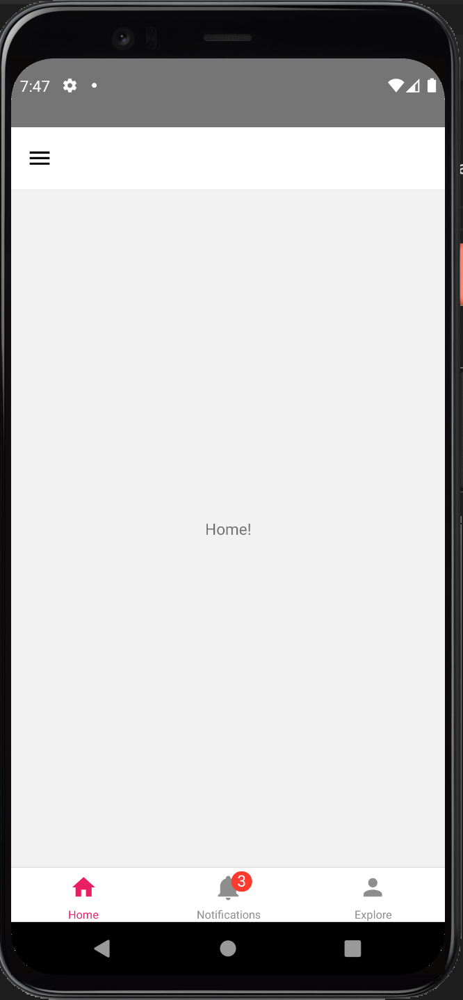

# react-native-RTK-boilerplate

A react native, redux toolkit, react-navigation and typescript template which everybody can clone and use it as a starting point of project.

## Getting start

To start your own project, you can create it from this template to install all useful packages once.
  `npx react-native init MyApp --template MahmonirB/react-native-RTK-boilerplate`

## Contains

- "react-native": "0.68.2"
- redux toolkit:
  - "@reduxjs/toolkit": "^1.8.2"
  - "react-redux": "^8.0.2"
  - "redux": "^4.2.0"
  - "redux-persist": "^6.0.0"
- react-navigation:
  - "@react-navigation/bottom-tabs": "^6.3.1"
  - "@react-navigation/drawer": "^6.4.1"
  - "@react-navigation/native": "^6.0.10"
  - "@react-navigation/native-stack": "^6.6.2"
  - "@react-navigation/stack": "^6.2.1"
  - "react-native-gesture-handler": "^2.4.2"
  - "react-native-reanimated": "^2.8.0"
  - "react-native-screens": "^3.13.1"
- "typescript": "^4.7.3"
- "react-native-vector-icons": "^9.1.0"

## Demo



## Features

- Structured project with absolute import

## Requirements

- Node 12 or greater
- Development for iOS requires a Mac and Xcode 10 or up

## Common problems

- If you run `yarn android` for the first time and get this error,
  > A problem occurred evaluating project :app. Could not get unknown property **FLIPPER_VERSION** for object of type org gradle.api.internal.artifacts.dsl.dependencies.DefaultDependencyHandler.

  - Solve: Add **gradle.properties** file into `/android` folder, and set these lines:

    ```
    android.useAndroidX=true
    android.enableJetifier=true
    FLIPPER_VERSION=0.99.0
    ```

- If you run `yarn android` and get this error,
  > Could not determine the dependencies of task app:compileDebugJavaWithJavac. SDK location not found. Define location with an ANDROID_SDK_ROOT environment variable or by setting the sdk.dir path in your projects local properties file at xxx/android/local.properties.
  - Solve: Add **local.properties** file into `/android` folder, and set
    `sdk.dir=/Users/[userName]/Library/Android/sdk`
  into it

- If you run `yarn android` and get this error:
  > What went wrong: Execution failed for task app:packageDebug. > A failure occurred while executing com.android.build.gradle.tasks.PackageAndroidArtifact$IncrementalSplitterRunnable > java.lang.OutOfMemoryError (no error message)
  >
  - Solve: Add this line to **gradle.properties**
    `org.gradle.jvmargs=-Xmx4608m`

- If you faced to this error, `Error: spawn /var/folders/xxx/T/rncli-init-template-IACwt5/node_modules/react-native-RTK-boilerplate/script.js EACCES`, please keep calm, it is not serious and you can continue with using your started package.
